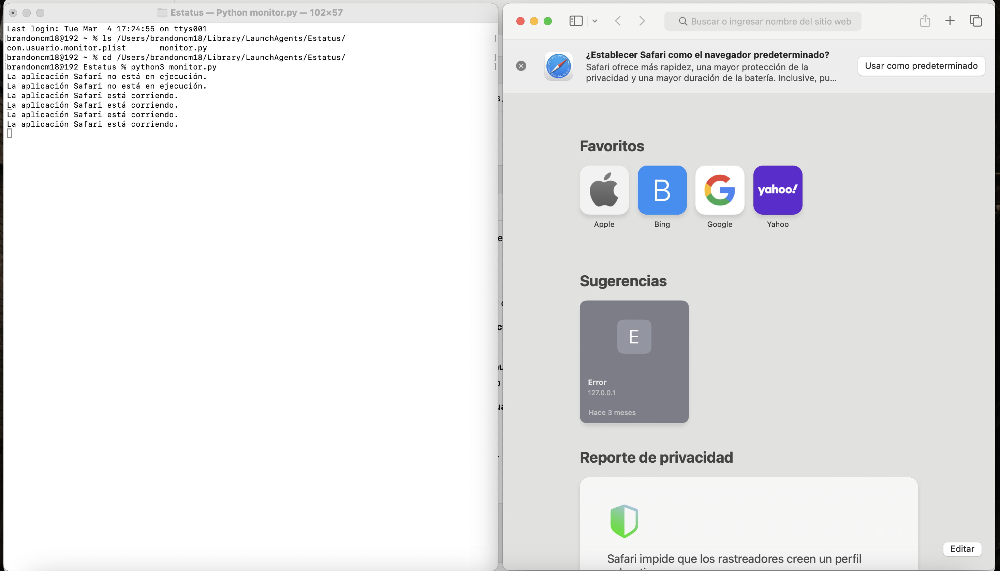
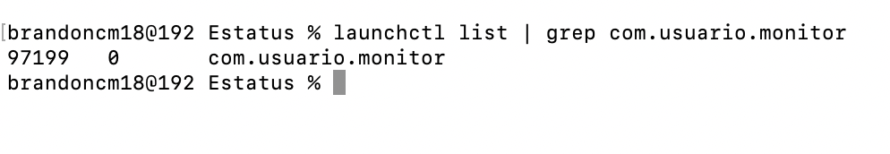

# Proyecto: Monitor de Estado de la Aplicación

Este proyecto consiste en un programa que monitorea el estado de una aplicación y la mantiene ejecutándose automáticamente al inicio de la sesión en macOS. El sistema verifica el estado de la aplicación y la reinicia si es necesario.

## Requisitos

- macOS
- Python 3
- `launchctl` para administrar los servicios del sistema

## Archivos

- **`monitor.py`**: Este es el script Python que monitorea el estado de la aplicación. Si la aplicación no está funcionando correctamente, el script la reinicia.
- **`com.usuario.monitor.plist`**: Es un archivo de configuración de `launchd` que permite que el script `monitor.py` se ejecute automáticamente al iniciar la sesión en macOS.

## Pasos para ejecutar el programa

### 1. Preparación

1. **Instalar Python 3**: Si no tienes Python 3 instalado, puedes descargarlo desde [python.org](https://www.python.org/downloads/).

2. **Colocar los archivos en las ubicaciones correspondientes**:
    - El archivo `monitor.py` debe estar en el directorio `/Users/brandoncm18/scripts/`.
    - El archivo `com.usuario.monitor.plist` debe estar en `/Users/brandoncm18/Library/LaunchAgents/`.

### 2. Configuración del archivo `plist`

1. **Copia el archivo `com.usuario.monitor.plist` a la carpeta `~/Library/LaunchAgents/`**:

   ```bash
   mv com.usuario.monitor.plist ~/Library/LaunchAgents/

2. **Asegúrate de que el archivo .plist apunte correctamente al script monitor.py. El contenido del archivo debe verse así**:

<plist version="1.0">
<dict>
    <key>Label</key>
    <string>com.usuario.monitor</string>
    <key>ProgramArguments</key>
    <array>
        <string>/opt/homebrew/bin/python3</string>
        <string>/Users/brandoncm18/scripts/monitor.py</string>
    </array>
    <key>RunAtLoad</key>
    <true/>
    <key>KeepAlive</key>
    <true/>
</dict>
</plist>


3. **Ejecuta el siguiente comando para cargar el servicio en launchctl**:

launchctl load ~/Library/LaunchAgents/com.usuario.monitor.plist

Esto hará que el script se ejecute automáticamente cada vez que inicies tu computadora.

### 3. Ejecutar el Script Manualmente

**Si deseas ejecutar el script manualmente para probar su funcionamiento, puedes hacerlo con el siguiente comando**:

```bash
python3 /Users/brandoncm18/scripts/monitor.py
```
### 4. Verificar que el servicio se está ejecutando

**Para verificar que el servicio está activo, ejecuta**:

```bash
launchctl list | grep com.usuario.monitor
```

Si ves la entrada com.usuario.monitor, significa que el servicio está funcionando correctamente.

### Capturas de pantalla

1. Captura mostrando el archivo monitor.py en ejecución.

2. Captura de la terminal mostrando el comando launchctl list.
 

### Conclusión

Este proyecto asegura que la aplicación se mantenga en ejecución incluso si algo falla, ayudando a que el sistema se recupere rápidamente sin intervención manual.

Este formato está correctamente estructurado en Markdown, con secciones bien definidas y código correctamente resaltado.
